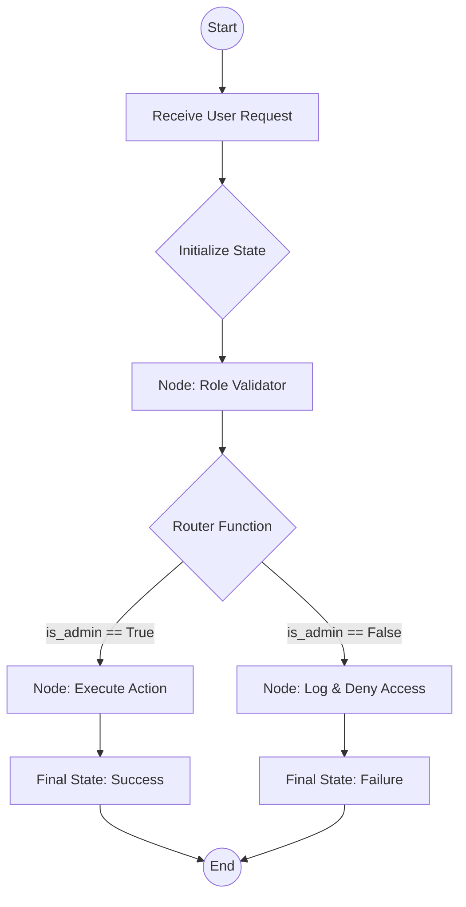

# LangGraph Research: Advanced Agentic Workflows

## 1. Introduction to LangGraph
**LangGraph** is a specialized framework designed to build stateful, multi-actor applications using Large Language Models (LLMs). While standard LangChain chains are primarily directed acyclic graphs (DAGs), LangGraph allows for **cycles**, enabling sophisticated agentic behaviors like iterative reasoning, self-correction, and long-running workflows.

---

## 2. Core Architectural Pillars

### 🧩 Nodes (Compute Units)
Nodes are the functional units of the graph. Each node represents a specific step in the process:
- **LLM Call**: Using a model to generate text or select a tool.
- **Tool Execution**: Performing an external action (e.g., API call, database query).
- **Data Transformation**: Processing or validating information before the next step.

### 🔗 Edges (Control Flow)
Edges define the transition logic between nodes:
- **Normal Edges**: Sequential flow (A → B).
- **Conditional Edges**: Dynamic routing based on the current state. A "router" function evaluates the state and returns the next node's name.

### 💾 State (Shared Memory)
The **State** is a persistent schema that tracks the lifecycle of an interaction.
- It is passed between nodes.
- Each node can update the state via "reducers" (e.g., appending to a message history).
- It ensures consistency across asynchronous or multi-step processes.

### 🤖 Agents (Decision Makers)
In LangGraph, an Agent is often a specific node loop. The agent uses an LLM to "decide" which tool to use, processes the tool's output, and loops back to decide if the task is complete.

---

## 3. Advanced Features: Persistence & Human-in-the-loop

### Checkpoints
LangGraph can automatically save the state after every node execution. This allows for:
- **Fault Tolerance**: Resuming a crashed workflow.
- **Time Travel**: Reverting to a previous state to try a different path.

### Human-in-the-loop
By adding an "interrupt" before specific nodes (e.g., an "Execute Payment" node), developers can pause the graph until a human provides approval or additional input.

---

## 4. Example Flow: Stateful Authorization
This diagram illustrates how an agentic graph handles an access request.

---

## 5. Summary of Benefits
1. **Control**: Fine-grained management over the LLM loop.
2. **Persistence**: Built-in state management and checkpointing.
3. **Complexity**: Handles recursive and multi-agent interactions that DAGs cannot.
